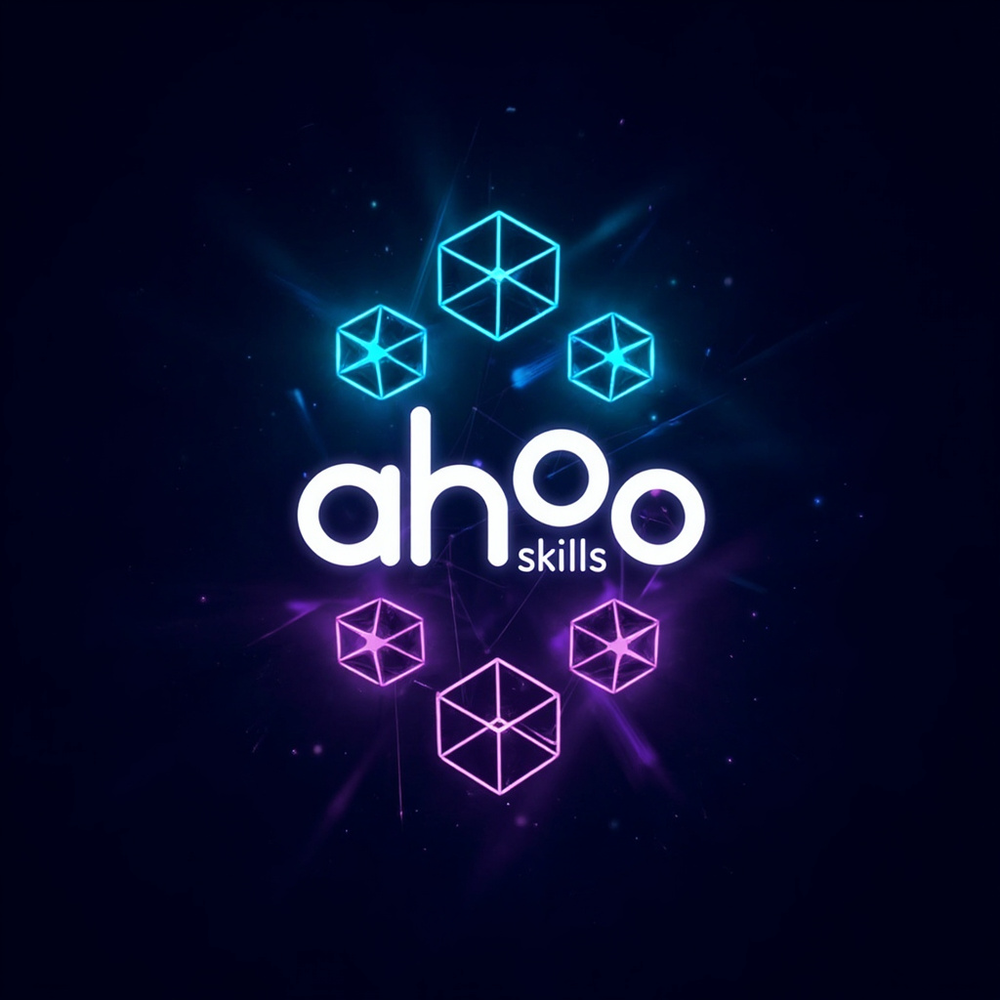

# Ahoo Skills



A central aggregation repository for [Agent Skills](https://agentskills.io/) from [Ahoo-Wang](https://github.com/Ahoo-Wang)'s open source projects.

Skills are automatically synced from source repositories **every 6 hours** via GitHub Actions.

## Source Repositories & Skills

| Repository | Skills |
|------------|--------|
| [Wow](https://github.com/Ahoo-Wang/Wow) | [`wow`](./skills/wow/SKILL.md) |
| [CoApi](https://github.com/Ahoo-Wang/CoApi) | [`coapi-developer`](./skills/coapi-developer/SKILL.md) |
| [CoSec](https://github.com/Ahoo-Wang/CoSec) | [`cosec-custom-matcher`](./skills/cosec-custom-matcher/SKILL.md), [`cosec-integration`](./skills/cosec-integration/SKILL.md), [`cosec-policy-author`](./skills/cosec-policy-author/SKILL.md), [`cosec-troubleshoot`](./skills/cosec-troubleshoot/SKILL.md) |
| [CosId](https://github.com/Ahoo-Wang/CosId) | [`cosid-manual-integration`](./skills/cosid-manual-integration/SKILL.md), [`cosid-sharding`](./skills/cosid-sharding/SKILL.md), [`cosid-spring-boot`](./skills/cosid-spring-boot/SKILL.md), [`cosid-strategy-guide`](./skills/cosid-strategy-guide/SKILL.md) |
| [FluentAssert](https://github.com/Ahoo-Wang/FluentAssert) | [`fluent-assert`](./skills/fluent-assert/SKILL.md) |
| [Fetcher](https://github.com/Ahoo-Wang/fetcher) | [`fetcher-cosec-auth`](./skills/fetcher-cosec-auth/SKILL.md), [`fetcher-decorator-service`](./skills/fetcher-decorator-service/SKILL.md), [`fetcher-eventbus`](./skills/fetcher-eventbus/SKILL.md), [`fetcher-integration`](./skills/fetcher-integration/SKILL.md), [`fetcher-llm-streaming`](./skills/fetcher-llm-streaming/SKILL.md), [`fetcher-openai-client`](./skills/fetcher-openai-client/SKILL.md), [`fetcher-openapi-generator`](./skills/fetcher-openapi-generator/SKILL.md), [`fetcher-openapi-types`](./skills/fetcher-openapi-types/SKILL.md), [`fetcher-react-hooks`](./skills/fetcher-react-hooks/SKILL.md), [`fetcher-storage`](./skills/fetcher-storage/SKILL.md), [`fetcher-viewer-components`](./skills/fetcher-viewer-components/SKILL.md), [`fetcher-wow-cqrs`](./skills/fetcher-wow-cqrs/SKILL.md) |
| [CoCache](https://github.com/Ahoo-Wang/CoCache) | [`cocache`](./skills/cocache/SKILL.md) |

## Installation

```bash
/plugin install ahoo-skills@github
```

## How It Works

- `repos.json` — source repository configuration
- `.github/workflows/sync-skills.yml` — sync workflow (runs every 6 hours)
- Each source repo is shallow-cloned and its `skills/` directory is rsync'd here

To add a new source repo, edit `repos.json` and push.

## Skill Structure

```
skills/<skill-name>/
├── SKILL.md          # Skill definition (YAML frontmatter + markdown)
├── references/       # Reference documentation (optional)
└── evals/            # Evaluation criteria (optional)
```

## License

[Apache License 2.0](./LICENSE)
